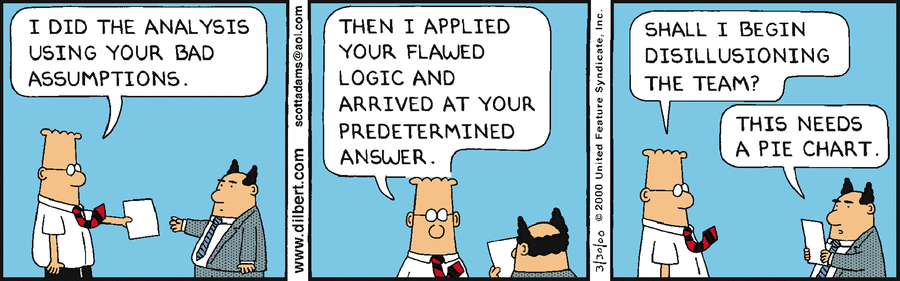

```{r setup, include=FALSE}
knitr::opts_chunk$set(echo = TRUE)
```

(Remove inspirational picture from your hand-in. It is also fine to remove introduction texts)

__Name:__

__KI id:__

__Exam ID:__

#Instructions

For deadlines etc, see Digital Exam

You have to supply both the answer (numbers, tables, plots, discussion or combinations thereof) as well as the R or Unix code you used to make the plots/results. This should be done using this R markdown template: we want both the R markdown file and the resulting __html__ file (__not a PDF!__). The html file is what you will present at the oral exam - it will be loaded on a computer/beamer when you arrive. At the oral exam, there may be questions on the homework and/or anything else from the course.

In the home work part, all aids are allowed except working with others since it is an individual exam. In the oral exam part, no aids are allowed except your html file.  

Please submit the results to both digital exam and absalon, to be safe. 

Note that:

1. If the R code or UNIX commands code gives different results than your results, you will get severe point reductions or even 0 points for the exercise

2. Some questions may request you to use R or UNIX commands /options we have not covered explicitly in the course: this is part of the challenge

3. Much like in an academic paper, the analysis and results should be presented on a level of detail that someone else could replicate the analysis. If not, we will deduct points.

4. Use tidyverse for all analyses and plotting, unless we explicitly used something else in class for the relevant plot or analysis (e.g. plotting trees, expression analysis on matrices, heat maps, etc)

For statistical tests, you have to:

1. Motivate the choice of test 

2. State exactly what the null and alternative hypothesis are (depends on test!) and the P-value threshold

3. Comment the outcome: do you reject the null hypothesis or not, and what does this mean for the actual question we wanted to answer (interpretation)?

## Questions 0:

__Question 3.0.1: Load ALL the packages you need for the entire assignment, and set your seed to 2018 using `set.seed(2018)`. Tip: use `{r message=FALSE, warning=FALSE}` in the  R markdown code to avoid spamming the report with non-helpful messages__
```{r message=FALSE, warning=FALSE}
library(tidyverse)
library(ggrepel)
library(DESeq2)
set.seed(2019)
theme_set(theme_bw())
```

## Question 1:
###Introduction
CpG islands are supposed to be associated with transcription start sites (TSSs) and thereby promoter regions. The common wisdom is that roughly 50%  of gene TSSs overlap one or more CpG islands in humans. Your goal is to find out whether this is true, and to answer a question that came up in class - is it also reciprocal: are around half of the CpG islands overlapping promoter regions? We also have an additional hypothesis: genes whose promoters overlap CpG islands have more exons than those who do not. In particular, we believe that genes whose promoters do not overlap CpG islands are more prone to only have one exon.

Let us define the promoter region as the first 300 bp upstream of  refseq TSSs. 

Download refseq track and CpG islands from the hg18 genome as .bed files.  Select the -300 to -1 region around refseq gene TSSs (so, one region per refseq row) using the `bedtools flank` tool. If you need the sizes of chromosomes in hg18, the `human.hg18.genome.txt`  file is included in the home work files. 

__Question 1.1.  What percentage of promoter regions overlap CpG islands with at least 1 bp?__

_Solution goes here_

__Question 1.2. What percentage of CpG islands overlap promoter regions with at least 1 bp?__

_Solution goes here_

__Question 1.3. Do refseq genes (defined as rows in the refseq track)  whose promoter region overlap CpG islands have significantly more or less exons than the ones whose promoters  do not overlap CpG islands? What is the difference in the exon count d distributions between these two gene sets?__

_Solution goes here_

__Question 1.4. Can you identify the most important problem with the analysis above (so, qustions 1.1 to 1.3) - and how would you solve it (only discussion text needed,   maximum of 50 words)?__

_Solution goes here_

## Question 2
###Introduction

Your collaborator is interested in enhancer regions. p300 is a general transcription factor which is often used to locate such regions. He/she made a ChIP-Seq  experiment on p300 in HeLa cells to investigate its binding to set of enhancer regions he got from previous studies. At the same time, he/she made a CAGE experiment on the same cells. Now, your collaborator has asked you to check the average CAGE and p300 ChIP signals across these regions.

Both normalized p300 ChIP and CAGE counts have already been extracted and saved into two tables (cage.txt and p300.txt in the data directory). Each row shows one  potential enhancer region. Note that the number of rows is not the same between these two sets, because cases with 0 counts in total were removed (you do not have to adjust your analysis for this).Columns show the distance to the center of midpoint of the enhancer in base pairs (e.g. -750 is 750 base pairs upstream of the enhancer midpoint). Values are  normalized CAGE or p300 ChIP intensities (as Tags Per Million) for each enhancer and position.The CAGE data have strand information, while ChIP data have not.


__Question 2.1: Using tidyverse only (no matrix operations, aggregate, etc),  make a SINGLE plot ( using `ggplot` and `facet_wrap`) showing the average CAGE signal  on the top panel and the average p300 signal  on the bottom panel, also showing the with standard error of the mean in both panels. Specifically: __

__Y = average CAGE or P300 ChIP signal per bp. __

__X = positions in bp  (+-1000 from enhancer center). __

__Make sure to distinguish the signals by strand for CAGE data. __

__Because we plot means, we would also like to have a measure of the variance - in this case the standard error of the mean. Unfortunately there is no R function for this, so you will have to make a custom function for this.  The formula for standard deviation of a vector called `x` is `sd(x)/sqrt(length(x))`. Add a ribbon (`geom_ribbon()`) to the plot which shows the +- standard error of the mean for each calculated mean value.__

__Comment on your plot. What are we actually seeing? Why is this important (150 words max)?__

_Solution goes here_

## Question 3
### Introduction ###

You have been hired by the Danish pharmaceutical giant Novo Nordisk to analyze an RNA-Seq study they have recently conducted. The study involves treatment of pancreatic islet cells with a new experimental drug for treatment of type 2 diabetes. Novo Nordisk wants to investigate how the drug affects cellular mRNA levels in general, and whether the expression of key groups of genes are affected. 

As the patent for the new experimental drug is still pending, Novo Nordisk has censored the names of genes. They also inform you that the one or more of the RNA-Seq library preparations might have failed. 

You have been supplied with 4 files:

- `studyDesign.tsv`: File describing treatment of the 10 samples included in the study.
- `countMatrix.tsv`: Number of RNA-Seq reads mapping to each of the genes.
- `normalizedMatrix.tsv`: Normalized expression to each of the genes.
- `diabetesGene.tsvs`: Collection of genes known to be involved in type 2 diabetes.

#### Part 1: Exploratory Data Analysis

__Question 3.1.1: Read all dataset into R, and make sure all the study design, count matrix and normalized matrix have matching numbers / names of both samples/treatments and genes.__

_Solution goes here_


__Question 3.1.2: Using the normalized matrix, perform a hierachical clustering on the samples using euclidian distance and average linkage, and plot the resulting tree.__

_Solution goes here_

__Question 3.1.3: Using the normalized matrix, perform a Principal Components Analysis (PCA) on the samples and produce a PCA-plot of the two first components, where the axis labels show the amount of variance explained by each component and samples are colored by their experimental group. Find a way to label the samples, so the identity (the sample name) of each point can easily be seen (hint: look at `geom_text()` or the ggrepel package!). Note, you should center but not scale the data.__

__Question 3.1.4: Based on the two previous questions, discuss (max 70 words) whether your observations indicate the presence of one or more failed sample preparations. Use the supplied count matrix to explore whether you believe the sample should be discarded prior to further analysis.__

_Solution goes here_

#### Part 2: Differential Expression (DE)

__Question 3.2.1: Discard any outlier(s) identified in Part 1 and use DESeq2 to obtain differentially expressed (DE) genes between the two experimental conditions. Use default parameter, except use a logFC threshold of 0.25 and an adjusted P-value threshold of 0.05.__

_Solution goes here_

__Question 3.2.2: Convert the output of DESeq2 to a tibble, and make an MA-plot using ggplot2. The MA-plot should show the overall trend using a trend line and genes should colored according to their DE status. Discuss whether the MA-plot indicates an approriate DESeq2 analysis (max 70 words discussion).__

_Solution goes here_

__Question 3.2.3: Report the number of upregulated genes and the number of downregulated genes (regardless of whether the MA plot above looks good or not).__

_Solution goes here_

__Question 3.2.4: Sort the DE statistics table  that you get from DESeq2 to report the top 5 genes sorted by__ 

__a) positive logFC (highest on top)__ 

__b) negative logFC (lowest on top)__

__only looking at significantly differentially expressed genes__

_Solution goes here_

#### Part 3: Gene Set enrichment 

__Question 3.3.1: Novo Nordisk claims their treatment affects expression of genes related to diabetes. Your task is to investigate whether this is true. They have supplied you with a long list of genes that are diabetes-related - diabetesGenes.tsv. One way to think about this file is that it lists all genes with a "diabetes" GO-term. Make a 2x2 contingency table that shows:__

```{r echo=F, message=FALSE, warning=FALSE}
table(`DE gene`=c(T, F, F, T), `Diabetes gene`=c(T, F, T, F))
```
__where the 1's are replaced by the actual counts. Hint: there are many ways of matching two vectors. One way is based on  `vector1 %in% vector2`  (we used it in the tidyverse lectures).__

_Solution goes here_

__Question 3.3.2: Once you have your 2x2 table, investigate whether differentally expressed genes are significantly _overrepresented_  (or, in other words,  _enriched_) in terms of diabetes genes. Report both the 2x2 contingency table used for the test and P-value, and discuss the result ( max 150 word discussion).__ 

_Solution goes here_
