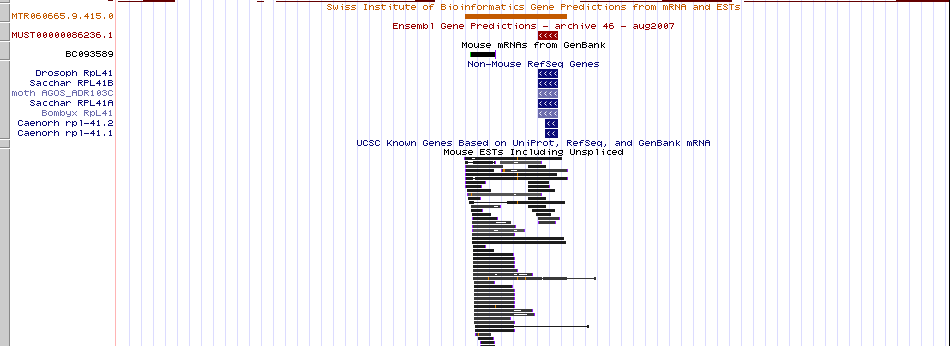
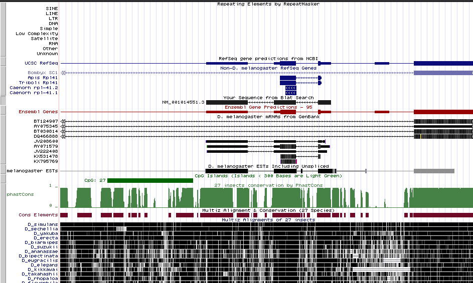
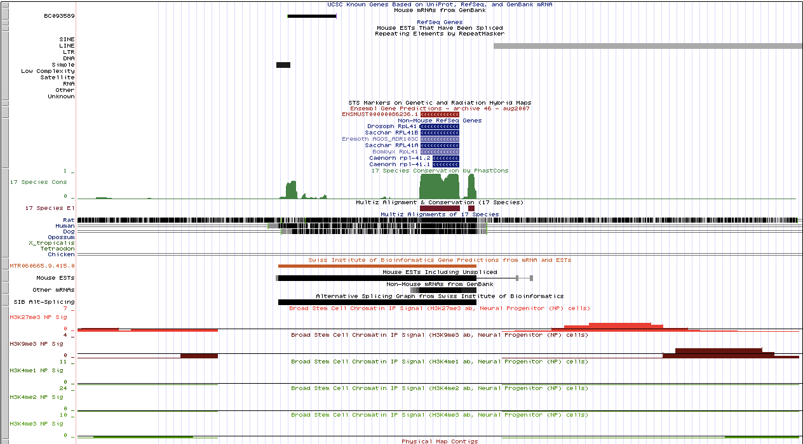

Name: Nuttapong Mekvipad, Ryan William Moreau, Rani Nielsen, Silvija Pupsaite, Liuqing Zheng

Group: 7

```{r setup, include=FALSE}
knitr::opts_chunk$set(echo = TRUE)
```


```{r, include=FALSE}
library(tidyverse)
```


## Question 1

a) The first five nucleotides of this transcript on the genome browser were 'AAAGG'.

b) The first five nucleotides of the raw AK002007 from GenBank were 'GAAGC'.

c) The discrepancy between the first five nucleotide in the genome browser and in the raw sequence might be due to the sequence found in genome browser was the result of mapping the raw AK002007 to human genome. Some part of raw mRNA (in this case first 7 nucleotides) might not be mapped to the genome due to various reasons. One of which, could be that the first 7 bp's might belong to other exon and this AK002007 is a truncated sequence without the rest of that exon. Additionally, it could be because of technical reasons such as sequencing error at the end of sequence which makes the similarity at the end of sequence might not be significant enough for mapping, or the extra 7 bp may come from truncated adapter that was not removed.  


## Question 2

**a) Finding the coverage of ERa na ERb sites on chromosome**

We sorted the ERa_hg18.bed and ERb_hg18.bed by chromosome number and starting position of ERa or ERb sites. Then caluculated the coverage of ERa and ERb site on each chromosome.

```{bash eval=FALSE}
sort -k1,1 -k2,2n ERa_hg18.bed > Sorted_ERa_hg18.bed

sort -k1,1 -k2,2n ERb_hg18.bed > Sorted_ERb_hg18.bed

nice bedtools genomecov -i Sorted_ERa_hg18.bed -g hg18_chrom_sizes.txt -max 1 > ERa_coverage.txt

nice bedtools genomecov -i Sorted_ERb_hg18.bed -g hg18_chrom_sizes.txt -max 1 > ERb_coverage.txt

```

We then loaded results into R for plotting.

```{r}
era_coverage <- read_tsv('ERa_coverage.txt', col_names = FALSE)
erb_coverage <- read_tsv('ERb_coverage.txt', col_names = FALSE)

```


```{r}
era_coverage_prop <- filter(era_coverage, X2==0) %>% 
  transmute(chromosome = X1, ERa= 1 - X5)
erb_coverage_prop <- filter(erb_coverage, X2==0) %>% 
  transmute(chromosome = X1, ERb = 1 - X5)

# convert chromosome to factor to prevent ggplot from sorting values
era_coverage_prop$chromosome <- factor(era_coverage_prop$chromosome, 
                                       levels = era_coverage_prop$chromosome)

erb_coverage_prop$chromosome <- factor(erb_coverage_prop$chromosome, 
                                       levels = erb_coverage_prop$chromosome)

full_join(era_coverage_prop, erb_coverage_prop, by = 'chromosome') %>% 
  gather(key = "type", value = "coverage", -chromosome) %>%
  ggplot(aes(x=chromosome, y=coverage, fill=type)) + geom_bar(stat = "identity", 
                                                              position = "dodge") +
  theme(axis.text.x = element_text(angle = 90))  
```

From the results, we can see that ERa and ERb site cover only the chromosome 1, 3, 6, 21, 22 and X. There are two possible reasons why we don't find the ERa and ERb sites on other chromosomes. One is that there actually is no ERa and ERb sites on the other chromosomes. However, it is unlikely for both sites to not be found on the rest of the 17 chromosomes. Furthermore, when we looked up the distribution of ERa and ERb sites, we found that they actually could be found on other chromosomes. For example, the ERa site could be found in the wnt11 and CTSD genes which are on chromosome 11 (Lin et al. 2007). The reason why only chromosome 1, 3, 6, 21, 22 and X were investigated here might due to the experimental limitation that the thiling array that was used in this experiment was designed to cover only those 6 chromosomes. The example of arrays that were designed to cover fews chromosomes is Affymetrix GeneChip Human Tiling  Arrays (https://www.affymetrix.com/support/technical/datasheets/human_tiling_datasheet.pdf).
This experimental limitation was also found in other study that use Affymetrix Human Tiling Arrays such as in Liu et al. 2008.


**b) Finding the number of overlapping ERa and ERb sites **

Next we wanted to see how much ERa and ERb sites overlap in data set. We used bedtools with following command to find the number of non-overlap sites.

```{bash eval=FALSE}
bedtools intersect -a ERa_hg18.bed -b ERb_hg18.bed -v | wc -l  # 236
bedtools intersect -a ERb_hg18.bed -b ERa_hg18.bed -v | wc -l  # 140
```

Then we plotted Venn diagram and found that there are a total of 582 ERa sites and 486 ERb sites with 346 overlapping sites between ERa and ERb.

```{r}
library(VennDiagram)
grid.newpage()
draw.pairwise.venn(581, 485, 346, category = c("ERa", "ERb"), 
                   lty = rep("blank", 2), fill = c("green", "light blue"))
```

## Question 3

To examine the argument of professor, we first looked at the possible structure of the gene that this 80 bp sequence belongs. Either, while looking at the tracks under gene and gene prediction e.g. RefSeq, Ensembl or SIB Genes, or looking at mRNA and ESTs tracks. From the gene and gene prediction tracks, there were 2 possible structures of the gene. These include a gene with one long exon (SIB Genes) and a gene with one short exon (Ensembl). The ESTs information also supported both structure (Figure 1).



Next we looked at the BLAT result of *D. melanogaster rpl*41, we can see from the figure (Figure 2) that the sturcture of *D. melanogaster rpl*41 was very different from the potential gene in the mouse. *D. melanogaster rpl*41 had 3 exons, and the conserved 80 bp sequence belongs to th 2nd exon. 



We also looked at the conservation along this potential gene in the mouse (Figure 3) and compared it with the conservation along the gene in *D. melanogaster* (Figure 2). We can see that in *D. melanogaster* the conservation was very high in all 3 exon regions. While, in the mouse the conservation of the gene was high, it was only at the region that the 80 bp sequence comes from. This different in structure might be due to the mouse gene being a truncated version of *D. melanogaster rpl*41, and the actual functional region is the conserved 80 bp region.



These discrepancies between the structure of *D. melanogaster rpl*41 and the mouse gene led us to question whether this sequence actually belongs to active ribosomal protein gene equivalent to *D. melanogaster rpl*41, or is part of rpl41 or not. 

To check the validity of the gene, we next looked at Broad H3 ChIPseq track to see the distribution of histone mark around the mouse potential gene. If this gene is actually an active functional gene, we should see some activation mark like H3K4Me1 to H3K4Me3. However, we can see from the figure (Figure 3) that in the mouse neuroprogenitor cells the mark found is mostly around the upstream of the gene where repressive marks such as H3K27Me3 or H3K9Me3 and very low level of H3K4Me1 to H3K4Me3 could be seen. This trend were all the same in other cell lines.

Interestingly, when we turned on RepatMasker track, we could see that in mouse there were many transposon e.g. LINE or SINE directly upstream of the potential gene, while the region around *D. melanogaster rpl*41 were free of transposon. This may explain why there were many repressive histone marks up-and downstream.

Furthermore, as suggested by the teacher, we BLAT this 80 bp region to the mouse genome itself. Then we look for the BLAT results that comes from differnt region (not from chr9:24,851,809-24,851,889 in question), and found 2 possible gene structures for this sequence in genome. The first type of structure was similar to what we found above which was the gene with single exon containing this 80 bp sequence (Figure 4). Another type of structure for this sequence was the gene with 3 separate exon where the 80 bp sequence span across those 3 exon (Figure 5). 

We then looked at the genes from BLAT results representing each of these 2 type of structure and found that there is no upstream transposon element at both gene. Also there are very high density of activation histone mark upstream and across both genes in either neuroprogenitor cell or other cell lines. This indicate that both forms of this potential rpl41 gene in mouse might be functional especially the form with 3 exon as the histone activation signal upstream and across that form of rpl41 gene are much more intense than the other form with single exon.

All of this information indicates that our 80 bp sequence in question might be part of mouse rpl41 gene, but this sequence at (chr9:24,851,809-24,851,889) might not be function due to the transposon upstream of this truncated gene. 


\\
\\
\\

## References

Lin, Z., Reierstad, S., Huang, C.C. and Bulun, S.E., 2007. Novel estrogen receptor-alpha binding sites and estradiol target genes identified by chromatin immunoprecipitation cloning in breast cancer. Cancer research, 67(10), pp.5017-5024.

Liu, Y., Gao, H., Marstrand, T.T., Str?m, A., Valen, E., Sandelin, A., Gustafsson, J.?. and Dahlman-Wright, K., 2008. The genome landscape of ER-alpha-and ER-beta-binding DNA regions. Proceedings of the National Academy of Sciences, 105(7), pp.2604-2609.


