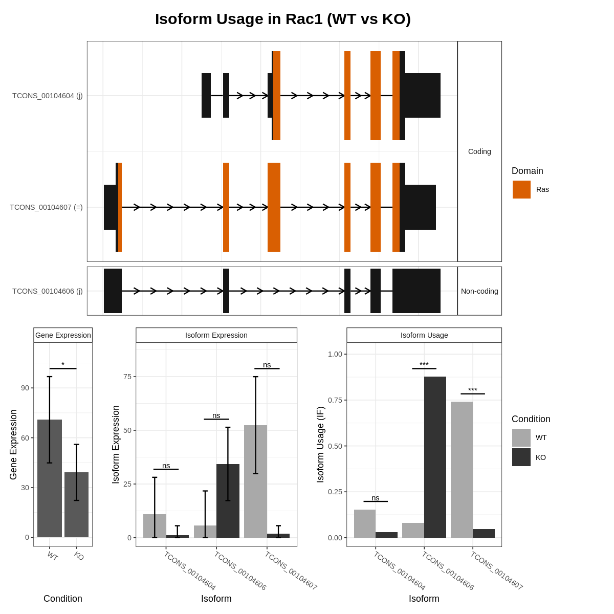

```{r setup, include=FALSE}
knitr::opts_chunk$set(echo = TRUE)
knitr::opts_knit$set(root.dir = "/home/nuttapong/Desktop/block4/hightp/homework3/HW3_combined_handout/")
```

```{r}

library(IsoformSwitchAnalyzeR)
library(tidyverse)
library(pheatmap)

```

### Question 1.1

```{r}
wt1_quant <- read_tsv("./salmon_result_part1/salmon_result_part1/WT1/quant.sf")
```


Here we plotted the isoform length versus effective length, and use geom smooth to show the trend line of the relationship between isoform length and effective length. The dash line shows the relationship when isoform lengths are equal to effective lengths.

From the plot, we can see that the actual relationship of isoform length and effective length was not linear relationship where isoform lengths are equal to effective lengths, but the effective lengths were actually shorter than the isoform length. This is due to the fact that during the cDNA library preparation step, we fragmented the cDNA and filter out the fragments that is smaller than certain threshold. 
These short fragments were mostly from the both end of cDNA; therefore the effective length is shorter than actual isoform length. 

Moreover, we can see that the deviation from identity line for the shorter isoform was much greater than the longer isoform. This is because the filtered out fragment make up to greater proportion based pair in shorter isoform than longer isoform given the certain filtering threshold. 

```{r}
wt1_quant %>% ggplot(aes(x=Length, y=EffectiveLength)) + 
  scale_x_continuous(trans='log10') + scale_y_continuous(trans='log10')  + 
  geom_point(alpha=0.3) +
  geom_smooth() + geom_abline(color = "red", linetype=2)
```

### Question 1.2

From the figure in question 1.1, we can see the the set of outliers that form the sigmoidal-like curve in the plot.

### Question 1.3

Here we import salmon data and transform the abundance matrix by the function $log_2(x+1)$ when x is abundance value. We can see the first 4 transcript in transformed abundance matrix below.

```{r}

all_salmons <- importIsoformExpression(parentDir =
                                         "./salmon_result_part1/salmon_result_part1/")
```

```{r}
salmon_matrix <- as.matrix(all_salmons$abundance[,2:ncol(all_salmons$abundance)])
rownames(salmon_matrix) <- all_salmons$abundance[,1]

transformed_salmon <- log2(salmon_matrix+1)

transformed_salmon[1:4,]
```

The reason why we add pseudocount = 1 to the abundace before apply $log_2$ to the abundance value is that if the abundance of the transcript in one condition is 0, when we apply $log_2$ to 0 the value will become infinity and will not be applicable for further down stream analysis. Adding pseudocount = 1 to the abundance before transform by $log_2$ will prevent this problem, and also $log_2$ of 1 is 0 which is make sense for further analysis as the starting value before transform is already 0.


### Question 1.4

We used tidyverse to exacte the 100 most variable isoforms as shows by code below. We first convert abundance matrix to tibble. Then we used mutate() to apply the variance function in a rowise manner by called rowwise() function before mutate(). After than we sort the tibble by variance and slice out top 100 transcript with highest variance between samples.

```{r}
salmon_tibble <- as_tibble(transformed_salmon, rownames=NA)

top100var <- salmon_tibble %>% rownames_to_column() %>% rowwise() %>% 
  mutate(variance=var(c(WT1, WT2, WT3, WTTPA1, WTTPA2, WTTPA3))) %>% 
  arrange(desc(variance)) %>% slice(1:100)

head(top100var, 5)

```

### Question 1.5

We plotted the heatmap of matrix contain the transformed abundance value of top 100 transcripts with highest variance among samples usinf pheatmap function.

From the heatmap we can see that the samples can be clustered by the expression profile into 2 groups. The first group contained WT2, WT3 and WTTPA1, and the second group contained WT1, WTTPA2 and WTTPA3). We can also see that those 2 groups has clearly different expression profile. The genes in top clusters of first group were expressed more than the bottom cluster, while the genes in top clusters of second group were expressed less than the bottom cluster. 

```{r}
top100var_mat <- as.matrix(top100var[,2:7])
rownames(top100var_mat) <- as.data.frame(top100var)[,1]
pheatmap(top100var_mat, show_rownames = TRUE, scale = "row", fontsize_row = 2.5, 
         fontsize_col = 5)
```

Moreover, we can see that in our code the argument scale was changed form the default which is "none" to "row". This will normalized the $log_2$ abundance value of all genes in each sample. The advantage of normalization is that it will put the $log_2$ abundance value on the same scale. This will enable us to compare the abundance value of the same gene between samples, and it also help us to clearly see the different between high and low expression gene across all samples when plotting heatmap.


## Question 2


```{r}
all_salmons2 <- importIsoformExpression(parentDir =
                                          "./salmon_result_part2/salmon_result_part2/")
```

### Question 2.1

First we load data into switchAnalyzeRList object using importRdata. The summary statistics of resulting switchAnalyzeRList were as below. 

```{r}
designMat <- data.frame(sampleID=colnames(all_salmons2$abundance)[-1],
                        condition=
                          str_replace(colnames(all_salmons2$abundance)[-1], "[0-9]", ""))

switchAnalyzeRList <- importRdata(isoformCountMatrix = all_salmons2$counts,
                                  isoformRepExpression = all_salmons2$abundance,
                                  designMatrix = designMat,
                                  isoformExonAnnoation =
                                    "./salmon_result_part2/salmon_result_part2/subset.gtf", 
                                  addAnnotatedORFs=FALSE)
switchAnalyzeRList
```

In total there were 7567 isoforms in the data set, and those isoforms came from 3304 genes. The samples came from two groups including the organism that splice factor X were knocked out and the wild type organism.

The options addAnnotatedORFs would be used only when we have the GTF file that specified the ORF region of each isform in our data set, and want to add that annotation about the position of ORF on our transcript to the current data. This ORF information can directly be used by IsoformSwitchAnalyzeR for down stream analysis such as for analyzing the consequences of isoform switch instead of having to predict ORF from analyzeORF() function.
However, we disable this option here by setting it to FALSE as we did not have GTF file contain ORF information.


### Question 2.2

The reason why the annotation in the GTF file must be the exact annotation quantified with Salmon is because the IsoformSwitchAnalyzeRwill annotate the isoform in isoformRepExpression data frame by matching the isoform_id in data frame with the isoform_id in GTF file. The isoform_id unlike GenBank accession number is not the fixed, specific id for each transcript isoform. Thereofre, the isoform_id can be changed between experiment. That is why we need to make sure that the annotation in GTF file is the exact annotation of the same data set from salmon in order to get correct annotation.


### Question 2.3

The table of top 10 switching genes with consequences sorted by q-values can be made by using below code. The top 10 genes are 5830418K08Rik, Ablim1, Tef, Xrcc6, Snx14, Slmap, Rac1, Fbxw7, Pld2 and Rrbp1, respectively.

```{r}
switchList <- readRDS("./hw3switchList.Rdata")
top10switch <- extractTopSwitches(switchList, filterForConsequences = TRUE,
                                  sortByQvals=TRUE, n=10)
top10switch
```

### Question 2.4

To made switch plot for top10 genes we used code below. The conditions are "KO" and "WT".

```{r eval=FALSE}
top10genes_name <- top10switch[,"gene_name"]
switchCondition <- switchList$conditions[,1]

for(gene in top10genes_name){
  # best resolution pics that are not too big
  png(paste0(gene, ".png", collapse = ""), width = 1200, height = 1200, res=160) 
  switchPlot(switchList, gene=gene, condition1 = switchCondition[1],
             condition2 = switchCondition[2])
  dev.off()
}
```

### Question 2.5

We picked Rac1 as the most important gene due to several reason. First, we suspected that the knocked out gene coded for splicing factor, so we expect that the genes that relevant to this knocking out should show clear splicing changes not other structural change such as transcription start site changes. This narrow down 10 genes to Rac1 where the swicth between isoform TCONS_00104606 and TCONS_00104607 was clearly can happended only by splicing change while in other genes the changes in isoform structure can also caused by TSS change. Moreover, the isoform with significatly increase in usage in knocked out mouse was non-coding isoform, while the isoform with significantly higher isoform usage in wild type mouse was the normal coding isoform that can be translated into functional protein. This means that this gene loss function in knocked out mouse due to isoform switch.



### Question 2.6

From the global enrichment plot the general changes in isform structure that were significant (FDR < 0.05) were ORF loss, domain loss, shortening of ORF, and conversion of transcript to non-coding transcript. All of these general changes can be introduced by both change in splicing pattern or change in trascription start site. So, we cannot clearly say whether these pattern support our original hypothesis that factor X might be splicing factor or not.

If factor X is actually splicing factor, we expected to observe that majority of switching would show alternative splicing. However, from alternative splicing analysis, we can see that less than half of switching show the sign of MES loss, IR gain, ES loss and ATTs gain also with FDR higher than 0.05. Only ATSS was found in more than half of switching events with FRD < 0.05. 

So, in related to our original hypothesis, we cannot say yet that factor X is splicing factor as the results here not firmly supported this hypothesis.

```{r}
extractConsequenceEnrichment(
    switchList,
    consequencesToAnalyze='all',
    analysisOppositeConsequence = TRUE,
    returnResult = FALSE
)
```

```{r}
extractSplicingEnrichment(
    switchList,
    returnResult = FALSE 
)
```


